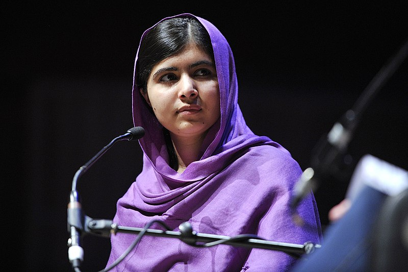

# test images

Malala Yousafzai

- taken from: https://commons.wikimedia.org/wiki/File:Malala_Yousafzai.jpg
- description: Malala Yousafzai is a campaigner who in 2012 was shot for her activist work. As part of WOW 2014, she talks about the systemic nature of gender inequality and bringing about change.
- author: Southbank Centre
- original source: https://www.flickr.com/photos/southbankcentre/13008430294/
- license: [CC-BY-2.0](https://creativecommons.org/licenses/by/2.0/deed.en)